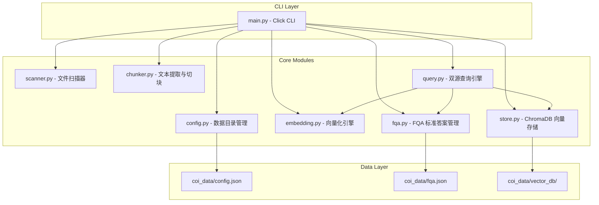
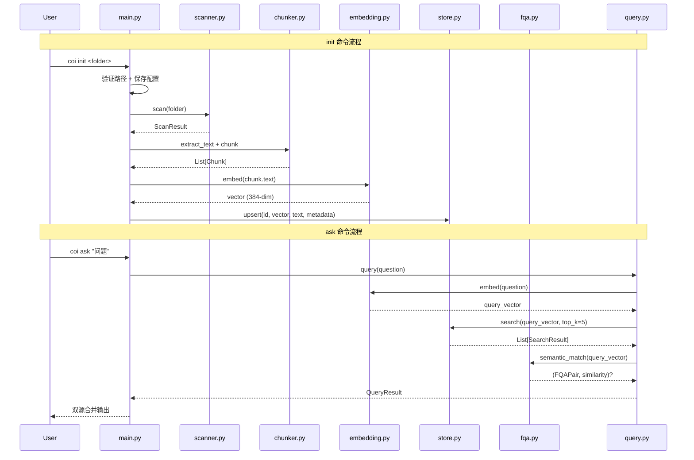

# Design Document: COI Refactor

## Overview

COI（我问你答）是一个纯本地离线文档问答工具，核心设计理念是将「向量库构建」与「查询检索」彻底解耦：

- **init** 命令负责一次性全量扫描文档目录并构建向量库（唯一写入入口）
- **ask** 命令仅读取已持久化的向量缓存和 FQA 标准答案，执行双源合并查询
- **add-fqa** 命令追加用户自定义问答对
- **clear** 命令一键清空所有数据

整个系统零网络依赖，所有数据存储于程序同级 `coi_data/` 目录，使用 ChromaDB 本地持久化向量数据库和 sentence-transformers 本地 Embedding 模型。

## Architecture



### 命令数据流



### 设计决策

1. **init 全量重建 vs 增量更新**：选择全量重建，简化实现复杂度，避免增量同步的一致性问题。用户文档变更后重新执行 init 即可。
2. **ask 纯读取**：ask 命令绝不触发扫描或重建，确保查询响应速度。
3. **延迟加载模型**：Embedding 模型在首次调用时才加载，避免不需要模型的命令（如 clear）承担加载开销。
4. **ChromaDB PersistentClient**：使用本地持久化模式，数据自动落盘，无需额外序列化逻辑。
5. **FQA 实时向量化**：FQA 匹配时对所有问题实时计算向量（而非预存向量），简化 add-fqa 流程，代价是 ask 时需要额外计算。

## Components and Interfaces

### config.py - 数据目录管理

```python
def get_data_dir() -> str:
    """获取 coi_data/ 绝对路径（程序同级目录）"""

def get_config_path() -> str:
    """获取 config.json 绝对路径"""

def get_fqa_path() -> str:
    """获取 fqa.json 绝对路径"""

def get_vector_db_path() -> str:
    """获取 vector_db/ 目录绝对路径"""

def load_config() -> Optional[dict]:
    """加载配置，不存在返回 None"""

def save_config(config: dict) -> None:
    """保存配置（自动创建父目录）"""
```

### scanner.py - 文件扫描器

```python
SUPPORTED_EXTENSIONS = {".txt", ".md", ".pdf", ".docx", ".xlsx", ".csv"}

class FileScanner:
    def scan(self, folder_path: str) -> ScanResult:
        """递归扫描目录，返回所有支持格式的文件列表。
        
        - 排除隐藏文件和隐藏目录（名称以 . 开头）
        - 扩展名匹配不区分大小写
        - 遇到文件系统错误时跳过并记录
        """
```

### chunker.py - 文本提取与切块

```python
class TextChunker:
    def __init__(self, tokenizer, chunk_size: int = 512, chunk_overlap: int = 64):
        """初始化切块器，使用 tokenizer 进行 token 计数"""

    def extract_text(self, file_path: str) -> Optional[str]:
        """从文件提取纯文本，失败返回 None"""

    def chunk(self, text: str) -> List[Chunk]:
        """按 token 切分文本，中文句子边界优先分割"""
```

### embedding.py - 向量化引擎

```python
class EmbeddingEngine:
    MODEL_NAME = "paraphrase-multilingual-MiniLM-L12-v2"
    VECTOR_DIM = 384

    def embed(self, text: str) -> np.ndarray:
        """单条文本向量化，返回 384 维归一化向量"""

    def embed_batch(self, texts: list) -> np.ndarray:
        """批量向量化，返回 (n, 384) 数组"""

    def get_tokenizer(self):
        """返回 tokenizer 供 TextChunker 使用"""
```

### store.py - ChromaDB 向量存储

```python
class VectorStore:
    def __init__(self, chroma_path: str, collection_name: str = "coi_knowledge"):
        """初始化向量存储"""

    def initialize(self) -> None:
        """创建/获取 collection（cosine 距离）"""

    def upsert(self, id: str, vector, text: str, metadata: ChunkMetadata) -> None:
        """插入或更新向量记录"""

    def delete_all(self) -> int:
        """删除所有记录，返回删除数量"""

    def search(self, vector, top_k: int = 5) -> List[SearchResult]:
        """语义检索，返回按距离升序排列的结果"""

    def get_record_count(self) -> int:
        """获取记录总数"""
```

### fqa.py - FQA 标准答案管理

```python
class FQAManager:
    def __init__(self, fqa_file_path: str):
        """初始化 FQA 管理器"""

    def load(self) -> List[FQAPair]:
        """加载所有 FQA 条目"""

    def append(self, question: str, answer: str) -> None:
        """追加问答对（自动创建文件和目录）"""

    def semantic_match(self, query_vector, embedding_engine, threshold: float = 0.85) -> Optional[Tuple[FQAPair, float]]:
        """语义匹配，返回最高相似度的匹配结果"""
```

### query.py - 双源查询引擎

```python
class QueryEngine:
    def __init__(self, embedding_engine, vector_store, fqa_manager, fqa_threshold: float = 0.85):
        """初始化查询引擎"""

    def query(self, question: str, top_k: int = 5) -> QueryResult:
        """执行双源合并查询：向量检索 + FQA 匹配"""
```

### models.py - 数据模型

```python
@dataclass
class FileChange:
    file_path: str          # 相对路径
    absolute_path: str      # 绝对路径
    status: str             # 'added'
    last_modified: Optional[int] = None  # 毫秒时间戳

@dataclass
class ScanResult:
    changes: List[FileChange] = field(default_factory=list)
    errors: List[dict] = field(default_factory=list)

@dataclass
class Chunk:
    text: str
    index: int
    token_count: int

@dataclass
class ChunkMetadata:
    file_path: str      # 源文件相对路径
    file_hash: str      # SHA-256
    chunk_index: int    # Chunk 序号
    last_modified: int  # 毫秒时间戳

@dataclass
class SearchResult:
    text: str
    metadata: ChunkMetadata
    distance: float     # cosine 距离（越小越相似）

@dataclass
class FQAPair:
    question: str
    answer: str

@dataclass
class QueryResult:
    fqa_answer: Optional[str] = None
    fqa_similarity: float = 0.0
    vector_chunks: List[SearchResult] = field(default_factory=list)
    vector_best_similarity: float = 0.0
```

## Data Models

### 持久化数据结构

#### config.json

```json
{
  "knowledge_folder": "/absolute/path/to/document/folder"
}
```

#### fqa.json

```json
[
  {"question": "什么是 COI？", "answer": "COI 是本地离线文档问答工具"},
  {"question": "如何更新知识库？", "answer": "重新执行 coi init 命令"}
]
```

#### vector_db/ (ChromaDB)

ChromaDB PersistentClient 管理的目录结构，内部包含：
- SQLite 数据库文件（元数据）
- HNSW 索引文件（向量索引）
- 数据段文件

每条向量记录包含：
| 字段 | 类型 | 说明 |
|------|------|------|
| id | string | `{relative_path}::{chunk_index}` |
| embedding | float[384] | 归一化向量 |
| document | string | 原始文本块内容 |
| metadata.file_path | string | 源文件相对路径 |
| metadata.file_hash | string | 源文件 SHA-256 |
| metadata.chunk_index | int | 块序号 |
| metadata.last_modified | int | 文件修改时间戳（ms） |

### 目录结构

```
coi/                    # 程序目录
├── main.py
├── config.py
├── scanner.py
├── chunker.py
├── embedding.py
├── store.py
├── fqa.py
├── query.py
├── models.py
├── build.py
├── setup.py
├── requirements.txt
└── coi_data/           # 数据目录（程序同级）
    ├── config.json
    ├── fqa.json
    └── vector_db/
```

## Correctness Properties

*A property is a characteristic or behavior that should hold true across all valid executions of a system—essentially, a formal statement about what the system should do. Properties serve as the bridge between human-readable specifications and machine-verifiable correctness guarantees.*

### Property 1: Path validation correctness

*For any* filesystem path, the Init_Command path validation SHALL accept the path if and only if the path exists and is a directory; all other paths (non-existent, regular files, symlinks to files) SHALL be rejected without modifying any data in Data_Directory.

**Validates: Requirements 1.1, 1.2**

### Property 2: Path resolution to absolute

*For any* valid directory path (relative, absolute, containing `..` or `.` segments), after Init_Command succeeds, the Config_Store SHALL contain the fully resolved absolute path equivalent to `os.path.abspath()` of the input.

**Validates: Requirements 1.3**

### Property 3: Config overwrite on re-init

*For any* sequence of Init_Command executions with different valid folder paths, the Config_Store SHALL always contain exactly the folder path from the most recent successful Init_Command execution, with no traces of previous paths.

**Validates: Requirements 1.6**

### Property 4: Scanner returns exactly supported non-hidden files

*For any* directory tree containing a mix of supported-format files, unsupported-format files, hidden files (name starting with `.`), and files within hidden directories, the Document_Scanner SHALL return exactly the set of non-hidden files with supported extensions (case-insensitive) that are not inside hidden directories.

**Validates: Requirements 2.1, 2.2**

### Property 5: Chunk size invariant

*For any* text input with more than 512 tokens, every chunk produced by Text_Chunker SHALL have a token count less than or equal to 512 tokens (chunk_size), and adjacent chunks SHALL overlap by approximately 64 tokens (chunk_overlap).

**Validates: Requirements 3.1**

### Property 6: Embedding dimension and normalization invariant

*For any* non-empty text string, the vector produced by Embedding_Engine.embed() SHALL have exactly 384 dimensions and an L2 norm within [0.99, 1.01] (normalized).

**Validates: Requirements 3.2**

### Property 7: Vector store round-trip

*For any* valid ChunkMetadata and text content, after upserting a record into Vector_Store and then searching with the same vector, the returned SearchResult SHALL contain the original text and all metadata fields (file_path, file_hash, chunk_index, last_modified) matching the inserted values.

**Validates: Requirements 3.3**

### Property 8: Ask command is read-only

*For any* valid question executed via Ask_Command against an initialized knowledge base, the contents of Data_Directory (file list, file sizes, file modification timestamps) SHALL remain unchanged after the command completes.

**Validates: Requirements 4.1**

### Property 9: Whitespace input rejection

*For any* string composed entirely of whitespace characters (spaces, tabs, newlines, or empty string), both Ask_Command (question parameter) and AddFQA_Command (question or answer parameter) SHALL reject the input with an error and terminate with a non-zero exit code without modifying any stored data.

**Validates: Requirements 4.4, 6.1**

### Property 10: Vector search results ordering and limit

*For any* query against a Vector_Store containing N records, the search results SHALL be ordered by similarity from highest to lowest (distance ascending), and the result count SHALL be min(top_k, N) where top_k defaults to 5.

**Validates: Requirements 5.1**

### Property 11: FQA threshold matching

*For any* query vector and set of FQA entries, the Query_Engine SHALL include an FQA answer in the result if and only if the maximum cosine similarity between the query vector and any FQA question vector is strictly greater than 0.85.

**Validates: Requirements 5.2, 5.3**

### Property 12: FQA append preserves all entries

*For any* sequence of N append operations to FQA_Store, after all operations complete, loading the FQA file SHALL return exactly N entries in insertion order, with each entry's question and answer matching the corresponding append call arguments.

**Validates: Requirements 6.3**

### Property 13: Data directory containment

*For any* sequence of COI commands (init, ask, add-fqa, clear), all file write operations SHALL occur exclusively within the Data_Directory (coi_data/), and the Data_Directory SHALL contain at most three items: config.json, fqa.json, and vector_db/.

**Validates: Requirements 8.1, 8.2, 8.3**

### Property 14: TXT extraction round-trip

*For any* valid UTF-8 text content written to a .txt file, the Text_Chunker.extract_text() SHALL return content that, after whitespace normalization, is equivalent to the original written content.

**Validates: Requirements 10.1**

### Property 15: CSV extraction format

*For any* CSV file with R rows and C columns, the Text_Chunker SHALL produce text with R lines where each line contains cell values joined by tab characters, preserving the original cell content and row order.

**Validates: Requirements 10.6**

## Error Handling

### 错误处理策略

| 场景 | 处理方式 | 退出码 |
|------|----------|--------|
| 路径不存在/非目录 | 显示错误信息，立即终止 | 1 |
| 未初始化时执行 ask | 提示用户先执行 init | 1 |
| 空问题/空答案 | 显示具体哪个字段无效 | 1 |
| 单文件提取失败 | 记录错误，跳过，继续处理 | 0（正常完成） |
| 模型加载失败 | 显示模型不可用错误 | 1 |
| 文件系统写入失败 | 显示错误详情到 stderr | 1 |
| ChromaDB 初始化失败 | 显示数据库错误 | 1 |
| FQA JSON 解析失败 | 返回空列表，不中断查询 | 0 |

### 错误输出规范

- 错误信息统一前缀 `[COI] 错误:`
- 错误输出到 stderr（`click.echo(..., err=True)`）
- 正常输出到 stdout
- 非零退出码统一使用 `sys.exit(1)`

### 容错设计

1. **文件级容错**：单个文件处理失败不影响其他文件，init 命令会在最终汇总中报告失败文件列表
2. **FQA 容错**：fqa.json 解析失败时返回空列表，不阻断查询流程
3. **目录自动创建**：所有写入操作前自动确保 Data_Directory 存在
4. **配置缺失检测**：ask 命令启动时检查 config.json 和 vector_db/ 是否存在

## Testing Strategy

### 测试框架

- **单元测试**: pytest
- **属性测试**: hypothesis (Python PBT 库)
- **测试配置**: 每个属性测试最少 100 次迭代

### 属性测试（Property-Based Testing）

适用于本项目的核心逻辑模块：

1. **scanner.py** - 文件过滤逻辑（Property 4）
2. **chunker.py** - 文本切块逻辑（Property 5）、文本提取（Property 14, 15）
3. **embedding.py** - 向量维度和归一化（Property 6）
4. **store.py** - 向量存储读写（Property 7, 10）
5. **fqa.py** - FQA 追加和加载（Property 12）
6. **query.py** - 阈值匹配逻辑（Property 11）
7. **config.py** - 路径解析（Property 2, 3）
8. **main.py** - 输入验证（Property 1, 9）

每个属性测试必须：
- 使用 `@given()` 装饰器配合 hypothesis strategies
- 最少运行 100 次迭代（`@settings(max_examples=100)`）
- 注释标注对应的设计属性编号

标签格式：`# Feature: coi-refactor, Property {N}: {property_text}`

### 单元测试（Example-Based）

覆盖以下场景：
- init 命令完整流程（含 mock 文件系统）
- ask 命令未初始化时的错误处理
- add-fqa 命令创建新文件 vs 追加已有文件
- clear 命令确认/取消流程
- 各文档格式的具体提取结果验证（PDF、DOCX、XLSX）
- 双源查询结果合并输出格式

### 集成测试

- 端到端流程：init → ask → add-fqa → ask（验证 FQA 生效）→ clear
- ChromaDB 持久化验证：写入后重新打开 client 能读取数据
- 模型加载和向量化的实际输出验证

### 测试目录结构

```
coi/
├── tests/
│   ├── __init__.py
│   ├── test_config.py          # config.py 单元测试
│   ├── test_scanner.py         # scanner.py 属性测试 + 单元测试
│   ├── test_chunker.py         # chunker.py 属性测试 + 单元测试
│   ├── test_embedding.py       # embedding.py 属性测试
│   ├── test_store.py           # store.py 属性测试 + 单元测试
│   ├── test_fqa.py             # fqa.py 属性测试 + 单元测试
│   ├── test_query.py           # query.py 属性测试 + 单元测试
│   ├── test_main.py            # CLI 命令集成测试
│   └── conftest.py             # 共享 fixtures
└── ...
```
