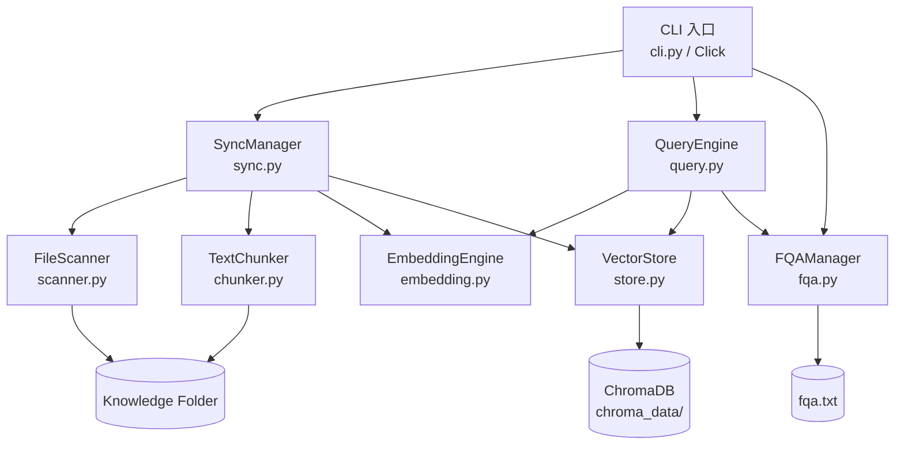
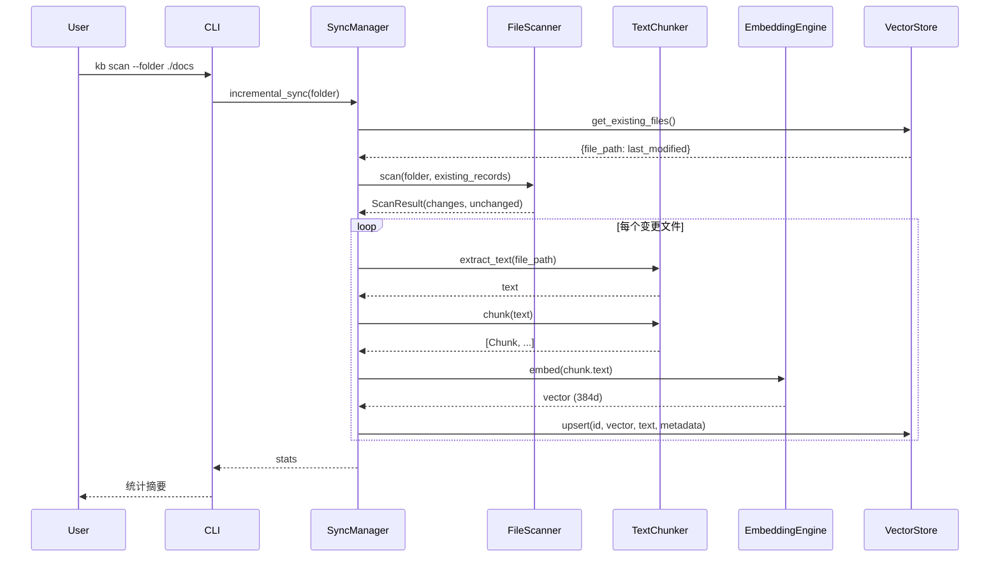

# 设计文档：本地知识库 RAG CLI 工具

## Overview

本地知识库系统是一个基于 Python CLI 的本地 RAG（检索增强生成）解决方案。系统采用一次性进程模式，按需触发文件扫描与向量库更新，不依赖后台服务或在线外部大模型。

核心能力：
- 多格式文档解析（TXT、Markdown、Word、Excel、PDF）
- 基于 sentence-transformers 的本地文本向量化（384 维）
- 基于 ChromaDB PersistentClient 的本地向量存储与语义检索
- FQA（人工纠错问答对）优先级匹配策略
- 增量同步与全量重建

技术栈：
- **语言**: Python 3.9+
- **CLI 框架**: Click
- **向量数据库**: ChromaDB PersistentClient（嵌入式，无需独立服务）
- **嵌入模型**: sentence-transformers / paraphrase-multilingual-MiniLM-L12-v2（384 维）
- **文档解析**: python-docx、openpyxl、PyPDF2、markdown-it-py
- **测试**: pytest + hypothesis

## Architecture

系统采用分层架构，各模块职责清晰，通过依赖注入实现松耦合：



**数据流：**



## Components and Interfaces

### CLI 入口 (`src/cli.py`)

使用 Click 框架定义命令组，支持全局选项和子命令：

```python
@click.group()
@click.option("--chroma-path", default="./chroma_data")
@click.option("--collection", default="knowledge_base")
@click.option("--fqa-path", default="./fqa.txt")
@click.option("--model", default="paraphrase-multilingual-MiniLM-L12-v2")
@click.option("--chunk-size", default=512, type=int)
@click.option("--chunk-overlap", default=64, type=int)
@click.option("--fqa-threshold", default=0.85, type=float)
@click.option("--top-k", default=5, type=int)
def cli(ctx, ...):
    """本地知识库 RAG CLI 工具"""
```

子命令：
- `kb scan --folder <path>` — 增量扫描并同步
- `kb query <question>` — 语义查询
- `kb rebuild --folder <path>` — 全量重建
- `kb fqa --add "问题=答案"` — 添加 FQA 记录

### FileScanner (`src/scanner.py`)

```python
class FileScanner:
    def scan(self, folder_path: str, existing_records: Dict[str, int]) -> ScanResult:
        """递归遍历文件夹，对比向量库记录，生成变更清单。
        
        Args:
            folder_path: 知识库文件夹路径
            existing_records: {相对路径: last_modified 时间戳(ms)}
            
        Returns:
            ScanResult(changes, unchanged, errors)
            
        Raises:
            FileNotFoundError: 路径不存在
            NotADirectoryError: 路径不是目录
        """
```

支持的文件扩展名：`.txt`, `.md`, `.doc`, `.docx`, `.xls`, `.xlsx`, `.pdf`

### TextChunker (`src/chunker.py`)

```python
class TextChunker:
    SUPPORTED_EXTENSIONS = {
        ".txt": "_extract_txt",
        ".md": "_extract_markdown",
        ".doc": "_extract_word",
        ".docx": "_extract_word",
        ".xls": "_extract_excel",
        ".xlsx": "_extract_excel",
        ".pdf": "_extract_pdf",
    }

    def __init__(self, tokenizer=None, chunk_size: int = 512, chunk_overlap: int = 64):
        ...

    def extract_text(self, file_path: str) -> Optional[str]:
        """从文件提取纯文本，根据扩展名分发到对应提取器"""

    def chunk(self, text: str) -> List[Chunk]:
        """将文本按 token 切分为多个 Chunk，保留重叠区域"""
```

切块策略：
- 使用模型 tokenizer 进行 token 计数
- 默认 512 token/块，64 token 重叠
- 优先在中文句子边界（。！？；\n）处切分
- 最后一块不足 overlap token 时合并到前一块

### EmbeddingEngine (`src/embedding.py`)

```python
class EmbeddingEngine:
    MODEL_NAME = "paraphrase-multilingual-MiniLM-L12-v2"
    VECTOR_DIM = 384

    def __init__(self, model_name: Optional[str] = None):
        """延迟加载策略，首次使用时加载模型"""

    def embed(self, text: str) -> np.ndarray:
        """单条文本向量化，返回 384 维归一化向量"""

    def embed_batch(self, texts: list) -> np.ndarray:
        """批量文本向量化，返回 shape=(n, 384) 的数组"""

    def get_tokenizer(self):
        """返回 tokenizer 实例供 TextChunker 使用"""
```

### VectorStore (`src/store.py`)

```python
class VectorStore:
    def __init__(self, chroma_path: str, collection_name: str = "knowledge_base"):
        ...

    def initialize(self) -> None:
        """创建或获取 collection，使用 cosine 距离度量"""

    def upsert(self, id: str, vector, text: str, metadata: ChunkMetadata) -> None:
        """插入或更新向量记录，ID 格式为 '{file_path}::{chunk_index}'"""

    def delete_by_file_path(self, file_path: str) -> None:
        """删除指定文件的所有向量记录"""

    def delete_all(self) -> int:
        """删除所有向量记录，返回删除数量"""

    def search(self, vector, top_k: int = 5) -> List[SearchResult]:
        """语义检索，返回按距离排序的结果"""

    def get_existing_files(self) -> Dict[str, int]:
        """获取已索引文件的 file_path -> last_modified 映射"""
```

### FQAManager (`src/fqa.py`)

```python
class FQAManager:
    def __init__(self, fqa_file_path: str):
        ...

    def load(self) -> List[FQAPair]:
        """加载并解析 FQA 文件，跳过空行和无效行"""

    def append(self, question: str, answer: str) -> None:
        """追加写入问答对，自动创建文件和父目录"""

    def semantic_match(self, query_vector: np.ndarray, embedding_engine) -> Optional[Tuple[FQAPair, float]]:
        """对所有 FQA 问题向量化后计算余弦相似度，返回最高匹配"""
```

### QueryEngine (`src/query.py`)

```python
class QueryEngine:
    FQA_THRESHOLD = 0.85

    def __init__(self, embedding_engine, vector_store, fqa_manager, fqa_threshold=0.85):
        ...

    def validate_question(self, question: str) -> bool:
        """验证查询问题是否有效（拒绝空/纯空白）"""

    def query(self, question: str, top_k: int = 5) -> QueryResult:
        """执行查询：验证 → 向量化 → FQA 匹配 → 阈值判断 → 回退向量检索"""
```

### SyncManager (`src/sync.py`)

```python
class SyncManager:
    def __init__(self, file_scanner, text_chunker, embedding_engine, vector_store):
        ...

    def incremental_sync(self, folder_path: str) -> dict:
        """增量同步：扫描变更 → 分类处理（新增/修改/删除）"""

    def full_rebuild(self, folder_path: str) -> dict:
        """全量重建：删除所有 → 重新扫描索引"""
```

修改文件的处理流程包含回滚机制：
1. 备份旧记录
2. 删除旧记录
3. 重新提取、切块、向量化、存储
4. 失败时恢复备份

## Data Models

```python
@dataclass
class FileChange:
    file_path: str          # 相对于 knowledge_folder 的路径
    absolute_path: str      # 文件绝对路径
    status: str             # 'added' | 'modified' | 'deleted'
    last_modified: Optional[int]  # 最后修改时间戳（毫秒）

@dataclass
class ScanResult:
    changes: List[FileChange]     # 变更文件列表
    unchanged: int                # 未变更文件数
    errors: List[dict]            # 错误列表 [{path, reason}]

@dataclass
class Chunk:
    text: str           # 切块文本内容
    index: int          # 在源文件中的序号（从 0 开始）
    token_count: int    # 该块的 token 数量

@dataclass
class ChunkMetadata:
    file_path: str      # 源文件相对路径
    file_hash: str      # 源文件 SHA-256 哈希
    chunk_index: int    # Chunk 序号
    last_modified: int  # 源文件最后修改时间戳（毫秒）

@dataclass
class SearchResult:
    text: str                   # 文本内容
    metadata: ChunkMetadata     # 元数据
    distance: float             # 余弦距离（越小越相似）

@dataclass
class FQAPair:
    question: str   # 问题
    answer: str     # 答案

@dataclass
class QueryResult:
    source: str                     # 'fqa' | 'vector_store'
    answer: Optional[str]           # FQA 答案或提示信息
    chunks: List[SearchResult]      # 向量检索结果
    similarity: float               # 最高相似度

@dataclass
class CLIConfig:
    knowledge_folder: str = "./docs"
    chroma_path: str = "./chroma_data"
    chroma_collection: str = "knowledge_base"
    fqa_file_path: str = "./fqa.txt"
    embedding_model: str = "paraphrase-multilingual-MiniLM-L12-v2"
    chunk_size: int = 512
    chunk_overlap: int = 64
    fqa_threshold: float = 0.85
    top_k: int = 5
```

**ChromaDB 存储结构：**

| 字段 | 类型 | 说明 |
|------|------|------|
| id | string | `{file_path}::{chunk_index}` |
| embedding | float[384] | 归一化向量 |
| document | string | 原始文本 |
| metadata.file_path | string | 源文件相对路径 |
| metadata.file_hash | string | SHA-256 哈希 |
| metadata.chunk_index | int | Chunk 序号 |
| metadata.last_modified | int | 修改时间戳(ms) |

**FQA 文件格式：**

```
如何退货=请联系客服400-xxx-xxxx，提供订单号即可申请退货
退货运费谁承担=质量问题由我方承担运费，非质量问题由买家承担
```

## Correctness Properties

*属性（Property）是在系统所有有效执行中都应成立的特征或行为——本质上是对系统应做什么的形式化陈述。属性是人类可读规范与机器可验证正确性保证之间的桥梁。*

### Property 1: 扫描器分类正确性

*对于任意*文件系统状态和已有记录映射，FileScanner 应将每个支持格式的文件正确分类：不在记录中的文件标记为 "added"，时间戳不一致的文件标记为 "modified"，记录中存在但文件系统中不存在的文件标记为 "deleted"，时间戳一致的文件计入 unchanged。

**Validates: Requirements 2.2, 2.3, 2.4**

### Property 2: 扫描器扩展名过滤

*对于任意*文件夹内容，FileScanner 的扫描结果中所有文件的扩展名都属于支持的扩展名集合（.txt, .md, .doc, .docx, .xls, .xlsx, .pdf），不支持的扩展名文件不会出现在变更清单中。

**Validates: Requirements 2.5, 2.6**

### Property 3: TXT 提取 round-trip

*对于任意*有效 UTF-8 文本字符串（非空且非纯空白），将其写入 .txt 文件后通过 TextChunker.extract_text 提取，应得到与原始文本相同的内容。

**Validates: Requirements 3.1**

### Property 4: Markdown 提取去除语法标记

*对于任意*包含 Markdown 语法标记（#、**、*、```等）的文本，通过 TextChunker 提取后的结果不应包含这些语法标记字符序列，但应保留所有纯文本内容。

**Validates: Requirements 3.2**

### Property 5: Word 提取保留段落

*对于任意*段落文本列表，创建 Word 文档后通过 TextChunker 提取，提取结果应包含所有段落文本且保持原始顺序。

**Validates: Requirements 3.3**

### Property 6: Excel 提取保留单元格

*对于任意*二维字符串表格数据，创建 Excel 文件后通过 TextChunker 提取，提取结果应包含所有非空单元格的字符串值。

**Validates: Requirements 3.4**

### Property 7: Chunk 大小不变量

*对于任意*非空文本，TextChunker.chunk 产生的每个 Chunk 的 token_count 不超过 chunk_size + chunk_overlap（合并最后一块时允许的最大值）。

**Validates: Requirements 3.6**

### Property 8: 相邻 Chunk 重叠正确性

*对于任意*产生多个 Chunk 的文本，相邻 Chunk 之间应有 chunk_overlap 个 token 的重叠：前一个 Chunk 的最后 chunk_overlap 个 token 应等于后一个 Chunk 的前 chunk_overlap 个 token。

**Validates: Requirements 3.7**

### Property 9: 最后一块最小长度

*对于任意*产生多个 Chunk 的文本，最后一个 Chunk 的 token_count 不应小于 chunk_overlap。

**Validates: Requirements 3.8**

### Property 10: Embedding 维度不变量

*对于任意*非空文本字符串，EmbeddingEngine.embed 返回的向量维度恒为 384，且为 numpy float32 数组。

**Validates: Requirements 4.1**

### Property 11: FQA 文件 round-trip

*对于任意*问答对列表（问题不含等号字符），通过 FQAManager.append 逐条写入后再通过 FQAManager.load 读取，应得到与原始列表相同的问答对（顺序一致）。

**Validates: Requirements 7.2, 7.3**

### Property 12: FQA 无效行过滤

*对于任意*包含有效行（含等号）和无效行（空行或不含等号的行）的 FQA 文件，FQAManager.load 应只返回有效行对应的问答对，跳过所有无效行。

**Validates: Requirements 7.6**

### Property 13: FQA 优先级阈值判定

*对于任意*查询，当 FQA 语义匹配的最高相似度大于 fqa_threshold 时，QueryEngine 应返回 source="fqa" 的结果；当相似度不大于 fqa_threshold 时，应返回 source="vector_store" 的结果。

**Validates: Requirements 8.2, 8.3**

### Property 14: 空查询拒绝

*对于任意*由空白字符（空格、制表符、换行符等）组成的字符串（包括空字符串），QueryEngine.query 应抛出 ValueError。

**Validates: Requirements 8.4**

### Property 15: 中文句子边界切分

*对于任意*包含中文句子边界标点（。！？；\n）的中文文本，当文本长度超过 chunk_size 时，TextChunker 应优先在句子边界处切分，使得切分点位于标点之后。

**Validates: Requirements 9.1, 9.4**

## Error Handling

| 场景 | 处理策略 | 用户反馈 |
|------|----------|----------|
| 知识库路径不存在 | 抛出 FileNotFoundError | CLI 输出错误信息，退出码 1 |
| 知识库路径不是目录 | 抛出 NotADirectoryError | CLI 输出错误信息，退出码 1 |
| 文件提取失败（损坏/编码错误） | 记录错误日志，跳过该文件 | 统计摘要中显示失败文件 |
| 单个 Chunk 向量化失败 | 跳过该 Chunk，继续处理 | 错误日志记录 |
| 修改文件更新失败 | 回滚到旧记录 | 统计摘要中显示失败及原因 |
| FQA 文件不存在 | 自动创建文件及父目录 | 无（静默处理） |
| FQA 文件 I/O 错误 | 抛出 RuntimeError | CLI 输出错误信息 |
| 空查询 | 抛出 ValueError | CLI 输出提示信息 |
| 向量检索无结果 | 返回提示信息 | 显示"未找到相关内容" |
| 模型加载失败 | 异常传播 | CLI 输出初始化失败信息 |

**回滚机制（修改文件）：**

```python
# 1. 备份旧记录
backup = self._get_file_records_backup(file_path)
# 2. 删除旧记录
self.vector_store.delete_by_file_path(file_path)
# 3. 尝试重新处理
try:
    chunks_stored = self._extract_chunk_embed_store(change)
except Exception:
    # 4. 失败时恢复备份
    self._restore_backup(backup)
```

## Testing Strategy

### 测试框架

- **单元测试**: pytest
- **属性测试**: hypothesis（property-based testing）
- **测试配置**: `pyproject.toml` 中 `[tool.pytest.ini_options]`

### 双重测试方法

**单元测试（pytest）：**
- 验证具体示例和边界条件
- 使用 `unittest.mock.MagicMock` 隔离外部依赖
- 覆盖错误处理路径和集成点

**属性测试（hypothesis）：**
- 验证跨所有输入的通用属性
- 每个属性测试最少运行 100 次迭代
- 每个测试标注对应的设计文档属性

### 属性测试配置

```python
from hypothesis import given, settings, strategies as st

@settings(max_examples=100)
@given(...)
def test_property_name(...):
    # Feature: local-knowledge-base, Property N: <property_text>
    ...
```

### 测试分层

| 层级 | 工具 | 覆盖范围 |
|------|------|----------|
| 属性测试 | hypothesis | 核心逻辑的通用正确性（切块、扫描、查询路由、FQA 解析） |
| 单元测试 | pytest + mock | 具体示例、错误处理、模块交互 |
| 集成测试 | pytest + 临时 ChromaDB | 端到端流程、持久化验证、模型质量 |

### 关键测试策略

**TextChunker 测试：**
- 使用 MockTokenizer（字符级 tokenization）隔离真实模型依赖
- 属性测试覆盖：chunk 大小不变量、重叠正确性、最后块合并
- 单元测试覆盖：各格式提取、空文件、损坏文件

**FileScanner 测试：**
- 使用 `tempfile.TemporaryDirectory` 创建临时文件系统
- 属性测试覆盖：分类正确性、扩展名过滤
- 单元测试覆盖：递归遍历、错误路径

**QueryEngine 测试：**
- 使用 MagicMock 隔离 EmbeddingEngine、VectorStore、FQAManager
- 属性测试覆盖：FQA 优先级阈值判定、空查询拒绝
- 单元测试覆盖：具体查询场景、调用顺序验证

**FQAManager 测试：**
- 使用临时文件进行 I/O 测试
- 属性测试覆盖：round-trip、无效行过滤
- 单元测试覆盖：文件创建、I/O 错误处理

**SyncManager 测试：**
- 使用 MagicMock 隔离所有依赖模块
- 单元测试覆盖：增量同步各场景、全量重建、回滚机制
- 集成测试覆盖：端到端同步流程
