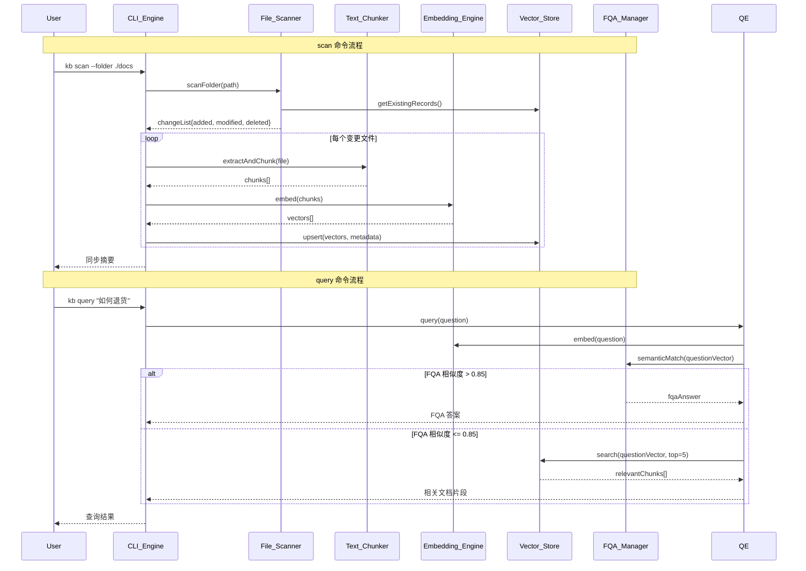
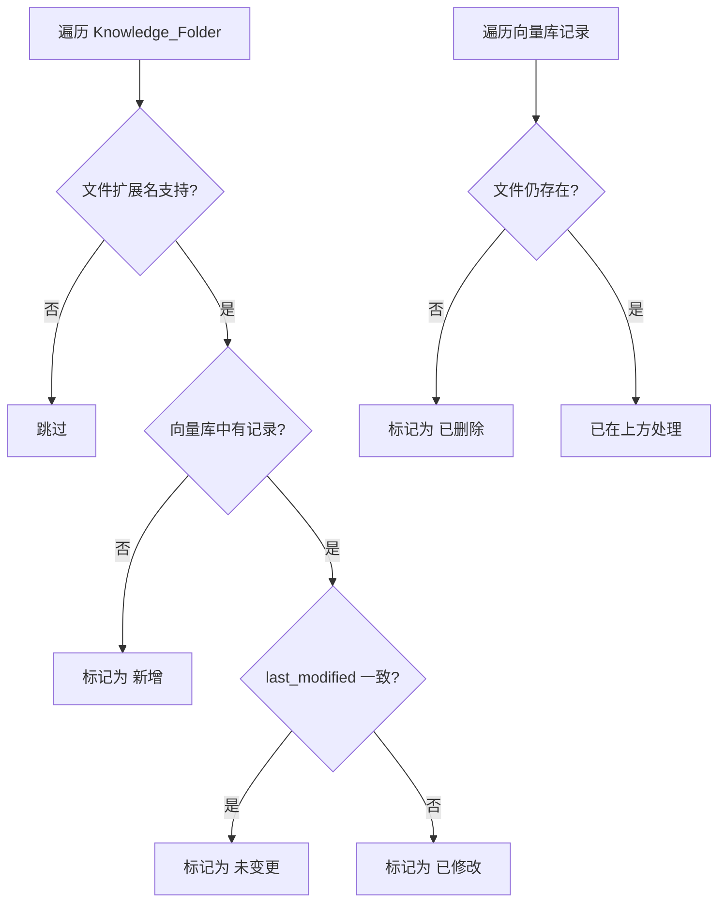

# Design Document

## Overview

本系统是一个基于 Node.js 的本地 RAG CLI 工具，采用一次性进程模式运行。核心架构为：

1. **CLI 层**：使用 `commander.js` 解析命令（scan、query、rebuild、fqa），调度各功能模块
2. **文件处理层**：递归扫描知识库文件夹，检测文件变更，提取多格式文档文本并切块
3. **向量化层**：使用本地 ONNX 模型（BGE-M3）通过 `@huggingface/transformers` 生成嵌入向量
4. **存储层**：通过 ChromaDB REST API 持久化存储向量及元数据
5. **查询层**：实现 FQA 优先级策略，先匹配人工纠错答案，再回退到向量检索

系统不依赖任何在线外部大模型服务，所有计算均在本地完成。

### 技术选型决策

| 组件 | 选型 | 理由 |
|------|------|------|
| 运行时 | Node.js (CommonJS) | 项目已有 package.json，生态成熟 |
| CLI 框架 | commander.js | Node.js 最成熟的 CLI 框架，支持子命令、参数校验、自动帮助信息 |
| 向量数据库 | ChromaDB (本地服务 + REST 客户端) | 本地持久化，`chromadb` npm 包提供 JS 客户端 |
| Embedding 模型 | Xenova/bge-m3 (ONNX) | 支持 100+ 语言含中文，1024 维向量，8192 token 上下文，通过 transformers.js 本地运行 |
| 文档提取 | officeparser (docx/xlsx) + pdf.js-extract (pdf) | 纯 Node.js 实现，无外部二进制依赖 |
| Tokenizer | BGE-M3 自带 tokenizer | 与 Embedding 模型一致，确保 token 计数准确 |
| 属性测试 | fast-check | Node.js 最成熟的 PBT 库 |

### ChromaDB 部署方式

ChromaDB 以本地服务模式运行（`chroma run --path ./chroma_data`），Node.js 程序通过 `chromadb` npm 包连接 REST API。用户需在使用前启动 ChromaDB 服务。

## Architecture

```mermaid
graph TB
    subgraph CLI Layer
        CLI[CLI_Engine<br/>commander.js]
    end

    subgraph Processing Layer
        FS[File_Scanner<br/>递归遍历 + 变更检测]
        TC[Text_Chunker<br/>文本提取 + 切块]
        EE[Embedding_Engine<br/>@huggingface/transformers<br/>Xenova/bge-m3]
    end

    subgraph Storage Layer
        VS[Vector_Store<br/>chromadb npm client]
        CHROMA[(ChromaDB Server<br/>本地持久化)]
    end

    subgraph FQA Layer
        FM[FQA_Manager<br/>问答对文件管理]
        QE[Query_Engine<br/>优先级查询策略]
    end

    CLI --> FS
    CLI --> QE
    CLI --> FM
    FS --> TC
    TC --> EE
    EE --> VS
    VS --> CHROMA
    QE --> FM
    QE --> EE
    QE --> VS
```

### 数据流



## Components and Interfaces

### CLI_Engine

```javascript
// src/cli.js
const { Command } = require('commander');

/**
 * CLI 配置项
 * @typedef {Object} CLIConfig
 * @property {string} knowledgeFolder - 知识库文件夹路径
 * @property {string} chromaUrl - ChromaDB 服务地址，默认 http://localhost:8000
 * @property {string} chromaCollection - ChromaDB collection 名称
 * @property {string} fqaFilePath - FQA 文件路径
 * @property {string} embeddingModel - Embedding 模型名称
 * @property {number} chunkSize - 切块大小（token），默认 512
 * @property {number} chunkOverlap - 重叠大小（token），默认 64
 * @property {number} fqaThreshold - FQA 匹配阈值，默认 0.85
 * @property {number} topK - 向量检索返回数量，默认 5
 */

// 命令定义
// kb scan --folder <path>           扫描并增量同步
// kb query <question>               查询知识库
// kb rebuild --folder <path>        全量重建
// kb fqa --add "问题=答案"          添加 FQA 记录
```

### File_Scanner

```javascript
// src/scanner.js

/**
 * @typedef {Object} FileChange
 * @property {string} filePath - 相对于 knowledgeFolder 的路径
 * @property {string} absolutePath - 绝对路径
 * @property {'added'|'modified'|'deleted'} status - 变更状态
 * @property {number} [lastModified] - 文件最后修改时间戳（毫秒）
 */

/**
 * @typedef {Object} ScanResult
 * @property {FileChange[]} changes - 变更文件列表
 * @property {number} unchanged - 未变更文件数
 * @property {Array<{path: string, reason: string}>} errors - 扫描错误
 */

const SUPPORTED_EXTENSIONS = new Set(['.txt', '.md', '.doc', '.docx', '.xls', '.xlsx', '.pdf']);

class FileScanner {
  /**
   * @param {string} folderPath - 知识库文件夹路径
   * @param {Map<string, number>} existingRecords - 已索引文件 file_path -> last_modified
   * @returns {Promise<ScanResult>}
   */
  async scan(folderPath, existingRecords) { /* ... */ }
}
```

### Text_Chunker

```javascript
// src/chunker.js

/**
 * @typedef {Object} Chunk
 * @property {string} text - 切块文本内容
 * @property {number} index - 在源文件中的序号（从 0 开始）
 * @property {number} tokenCount - 该块的 token 数量
 */

/**
 * @typedef {Object} ChunkOptions
 * @property {number} chunkSize - 目标块大小，默认 512 tokens
 * @property {number} overlap - 重叠区域，默认 64 tokens
 */

class TextChunker {
  /**
   * @param {Object} tokenizer - BGE-M3 tokenizer 实例
   * @param {ChunkOptions} options
   */
  constructor(tokenizer, options) { /* ... */ }

  /**
   * 从文件提取文本
   * @param {string} filePath - 文件绝对路径
   * @returns {Promise<string>} 提取的纯文本
   */
  async extractText(filePath) { /* ... */ }

  /**
   * 将文本切分为 Chunk
   * @param {string} text - 原始文本
   * @returns {Chunk[]}
   */
  chunk(text) { /* ... */ }

  /**
   * 在 token 序列中找到最近的中文句子边界
   * @param {number[]} tokens - token ID 序列
   * @param {number} maxPos - 最大位置
   * @returns {number} 切分位置
   */
  findSentenceBoundary(tokens, maxPos) { /* ... */ }
}
```

**文本提取策略**：

| 文件格式 | 提取方式 | 策略 |
|----------|----------|------|
| .txt | fs.readFile (UTF-8) | 直接读取 |
| .md | 正则移除语法标记 | 保留结构换行，移除 #、*、[]() 等 |
| .doc/.docx | officeparser | 按段落顺序提取 |
| .xls/.xlsx | officeparser | 按工作表→行→单元格拼接 |
| .pdf | pdf.js-extract | 按页码顺序提取文本 |

### Embedding_Engine

```javascript
// src/embedding.js

class EmbeddingEngine {
  static MODEL_NAME = 'Xenova/bge-m3';
  static VECTOR_DIM = 1024;

  /**
   * @param {string} [modelName] - 模型名称，默认 Xenova/bge-m3
   */
  constructor(modelName) { /* ... */ }

  /**
   * 初始化模型（延迟加载）
   */
  async initialize() { /* ... */ }

  /**
   * 单条文本向量化
   * @param {string} text
   * @returns {Promise<number[]>} 1024 维向量
   */
  async embed(text) { /* ... */ }

  /**
   * 批量文本向量化
   * @param {string[]} texts
   * @returns {Promise<number[][]>}
   */
  async embedBatch(texts) { /* ... */ }

  /**
   * 获取 tokenizer 实例（供 Text_Chunker 使用）
   * @returns {Object}
   */
  getTokenizer() { /* ... */ }
}
```

### Vector_Store

```javascript
// src/store.js

/**
 * @typedef {Object} ChunkMetadata
 * @property {string} file_path - 源文件相对路径
 * @property {string} file_hash - 源文件内容 SHA-256 哈希
 * @property {number} chunk_index - Chunk 序号
 * @property {number} last_modified - 源文件最后修改时间戳
 */

/**
 * @typedef {Object} SearchResult
 * @property {string} text - 文本内容
 * @property {ChunkMetadata} metadata - 元数据
 * @property {number} distance - 距离（越小越相似）
 */

class VectorStore {
  /**
   * @param {string} chromaUrl - ChromaDB 服务地址
   * @param {string} collectionName - Collection 名称
   */
  constructor(chromaUrl, collectionName) { /* ... */ }

  async initialize() { /* ... */ }

  /**
   * 插入或更新向量记录
   * ID 格式: "{file_path}::{chunk_index}"
   */
  async upsert(id, vector, text, metadata) { /* ... */ }

  /** 删除指定文件的所有向量记录 */
  async deleteByFilePath(filePath) { /* ... */ }

  /** 删除所有向量记录 */
  async deleteAll() { /* ... */ }

  /** 语义检索 */
  async search(vector, topK) { /* ... */ }

  /** 获取已索引文件的 file_path -> last_modified 映射 */
  async getExistingFiles() { /* ... */ }

  /** 获取当前向量记录总数 */
  async getRecordCount() { /* ... */ }
}
```

### FQA_Manager

```javascript
// src/fqa.js

/**
 * @typedef {Object} FQAPair
 * @property {string} question
 * @property {string} answer
 */

class FQAManager {
  /**
   * @param {string} fqaFilePath - FQA 文件路径
   */
  constructor(fqaFilePath) { /* ... */ }

  /**
   * 加载并解析 FQA 文件
   * @returns {Promise<FQAPair[]>}
   */
  async load() { /* ... */ }

  /**
   * 追加写入一条问答对
   * @param {FQAPair} pair
   */
  async append(pair) { /* ... */ }

  /**
   * 对 FQA 问题进行语义匹配
   * @param {number[]} queryVector - 查询向量
   * @param {EmbeddingEngine} embedEngine
   * @returns {Promise<{bestMatch: FQAPair|null, similarity: number}>}
   */
  async semanticMatch(queryVector, embedEngine) { /* ... */ }
}
```

### Query_Engine

```javascript
// src/query.js

/**
 * @typedef {Object} QueryResult
 * @property {'fqa'|'vector_store'} source - 结果来源
 * @property {string} [answer] - FQA 答案
 * @property {SearchResult[]} [chunks] - 向量检索结果
 * @property {number} similarity - 最高相似度
 */

class QueryEngine {
  static FQA_THRESHOLD = 0.85;

  /**
   * @param {EmbeddingEngine} embeddingEngine
   * @param {VectorStore} vectorStore
   * @param {FQAManager} fqaManager
   */
  constructor(embeddingEngine, vectorStore, fqaManager) { /* ... */ }

  /**
   * 执行查询
   * @param {string} question
   * @param {number} [topK=5]
   * @returns {Promise<QueryResult>}
   */
  async query(question, topK = 5) { /* ... */ }

  /**
   * 验证查询是否有效（非空、非纯空白）
   * @param {string} question
   * @returns {boolean}
   */
  validateQuestion(question) { /* ... */ }
}
```

## Data Models

### ChromaDB Collection Schema

```
Collection: "knowledge_base" (可配置)
Distance Metric: cosine

Document Structure:
- id: string              // 格式: "{file_path}::{chunk_index}"
- embedding: float[]      // 1024 维向量 (BGE-M3)
- document: string        // Chunk 原始文本
- metadata:
    - file_path: string   // 相对路径
    - file_hash: string   // SHA-256
    - chunk_index: int    // 从 0 开始
    - last_modified: int  // Unix 时间戳（毫秒）
```

### FQA 文件格式

```text
# 每行一个问答对，等号分隔
# 空行和不含等号的行将被跳过
如何退货=请联系客服400-xxx-xxxx，提供订单号即可申请退货
退货运费谁承担=质量问题由我方承担运费，非质量问题由买家承担
```

- 编码：UTF-8
- 每行一个问答对
- 分隔符：第一个 `=` 字符（问题部分不得包含等号）
- 空行和不含 `=` 的行被跳过

### 配置

系统配置通过 CLI 参数和环境变量传入：

| 配置项 | CLI 参数 | 环境变量 | 默认值 |
|--------|----------|----------|--------|
| 知识库路径 | --folder | KB_FOLDER | ./docs |
| ChromaDB 地址 | --chroma-url | CHROMA_URL | http://localhost:8000 |
| Collection 名称 | --collection | CHROMA_COLLECTION | knowledge_base |
| FQA 文件路径 | --fqa-path | FQA_PATH | ./fqa.txt |
| Embedding 模型 | --model | EMBEDDING_MODEL | Xenova/bge-m3 |
| 切块大小 | --chunk-size | CHUNK_SIZE | 512 |
| 重叠大小 | --chunk-overlap | CHUNK_OVERLAP | 64 |
| FQA 阈值 | --fqa-threshold | FQA_THRESHOLD | 0.85 |
| 检索数量 | --top-k | TOP_K | 5 |

### 文件变更检测逻辑



### 项目目录结构

```
question-and-answer/
├── src/
│   ├── cli.js              # CLI 入口与命令定义
│   ├── scanner.js          # 文件扫描与变更检测
│   ├── chunker.js          # 文本提取与切块
│   ├── embedding.js        # 本地 Embedding
│   ├── store.js            # ChromaDB 向量存储
│   ├── fqa.js              # FQA 文件管理
│   ├── query.js            # 查询引擎
│   └── sync.js             # 增量同步协调
├── tests/
│   ├── scanner.test.js
│   ├── chunker.test.js
│   ├── fqa.test.js
│   ├── query.test.js
│   ├── sync.test.js
│   └── properties/         # 属性测试
│       ├── scanner.prop.js
│       ├── chunker.prop.js
│       ├── fqa.prop.js
│       ├── query.prop.js
│       └── sync.prop.js
├── docs/
│   └── 我的需求.md
├── package.json
└── README.md
```


## Correctness Properties

*A property is a characteristic or behavior that should hold true across all valid executions of a system — essentially, a formal statement about what the system should do. Properties serve as the bridge between human-readable specifications and machine-verifiable correctness guarantees.*

### Property 1: 文件变更检测正确性

*For any* set of files on disk and any set of existing records in the vector store, the File_Scanner SHALL classify each entry correctly: files on disk but not in records are "added", files in both but with different timestamps are "modified", records without corresponding files on disk are "deleted", and files with matching timestamps are "unchanged".

**Validates: Requirements 2.2, 2.3, 2.4**

### Property 2: 文件扩展名过滤

*For any* file path, the File_Scanner SHALL include it in the scan results if and only if its extension is in the supported set {.txt, .md, .doc, .docx, .xls, .xlsx, .pdf} (case-insensitive).

**Validates: Requirements 2.5, 2.6**

### Property 3: 文本切块不变量

*For any* non-empty text input, the Text_Chunker SHALL produce chunks where: (a) each chunk contains at most 512 tokens, (b) for any two adjacent chunks, the last 64 tokens of the preceding chunk equal the first 64 tokens of the following chunk, and (c) if the final remainder is less than 64 tokens, it is merged into the preceding chunk rather than forming a separate chunk.

**Validates: Requirements 3.6, 3.7, 3.8**

### Property 4: FQA 文件解析往返

*For any* list of valid FQA pairs (where questions contain no "=" character and no newline), serializing them to the "question=answer" line format and then parsing the result back SHALL produce the original list of pairs.

**Validates: Requirements 7.2**

### Property 5: FQA 解析鲁棒性

*For any* FQA file content containing a mix of valid "question=answer" lines, empty lines, and lines without the "=" separator, the FQA_Manager SHALL return exactly the set of valid pairs, preserving their order, and silently skip all invalid lines.

**Validates: Requirements 7.6**

### Property 6: FQA 追加保序性

*For any* sequence of FQA pairs appended to a file, reading the file back SHALL return all previously existing pairs followed by all newly appended pairs in their original append order.

**Validates: Requirements 7.3**

### Property 7: 查询优先级阈值决策

*For any* query and FQA dataset, if the maximum semantic similarity between the query and any FQA question exceeds 0.85, the Query_Engine SHALL return the corresponding FQA answer without querying the Vector_Store; otherwise it SHALL query the Vector_Store and return the top 5 results.

**Validates: Requirements 8.2, 8.3**

### Property 8: 空白查询拒绝

*For any* string composed entirely of whitespace characters (including empty string), the Query_Engine SHALL reject the query and return an error prompt without performing any semantic matching.

**Validates: Requirements 8.4**

### Property 9: 中文句子边界切分

*For any* Chinese text containing sentence-ending punctuation (。！？；\n), the Text_Chunker SHALL prefer to split at the nearest sentence boundary within the 512-token limit, and SHALL never split a multi-byte character across chunk boundaries. For mixed Chinese-English text, language transitions SHALL NOT force a chunk boundary.

**Validates: Requirements 9.1, 9.4**

### Property 10: 增量同步一致性

*For any* change list produced by File_Scanner, after incremental sync completes: (a) all "added" files have their chunks stored with correct metadata, (b) all "modified" files have only their new chunks stored (old chunks removed), (c) all "deleted" files have zero chunks in the store, (d) all "unchanged" files retain their original chunks unmodified, and (e) the output summary counts match the actual changes applied.

**Validates: Requirements 5.1, 5.2, 5.4, 5.5, 5.6**

### Property 11: 无效命令处理

*For any* command string that is not in the valid command set {scan, query, rebuild, fqa}, or any valid command with missing/malformed required parameters, the CLI_Engine SHALL output usage/help information and exit with code 1.

**Validates: Requirements 1.2, 1.3**

### Property 12: Embedding 维度不变量

*For any* non-empty text string, the Embedding_Engine SHALL produce a vector of exactly 1024 dimensions (BGE-M3 output size), regardless of input length or language.

**Validates: Requirements 4.1**

### Property 13: 向量存储幂等性与元数据完整性

*For any* chunk with a given file_path and chunk_index, upserting it multiple times SHALL result in exactly one record in the store, and that record SHALL contain all required metadata fields (file_path, file_hash, chunk_index, last_modified) with the values from the most recent upsert.

**Validates: Requirements 4.3, 4.4**

## Error Handling

### 错误处理策略

系统采用"跳过并继续"的容错策略，确保单个文件的处理失败不会中断整体流程。

| 错误场景 | 处理方式 | 退出码 |
|----------|----------|--------|
| Knowledge_Folder 路径无效 | 终止扫描，输出错误信息 | 1 |
| 文件编码无法识别/文件损坏 | 记录错误日志，跳过该文件 | 0 |
| 文件内容为空 | 记录警告日志，跳过该文件 | 0 |
| Embedding 生成失败 | 记录错误日志，跳过该 Chunk | 0 |
| ChromaDB 连接失败 | 终止操作，输出连接错误信息 | 1 |
| 已修改文件更新过程中失败 | 回滚该文件，保留原有记录 | 0 |
| FQA 文件 I/O 错误 | 显示错误信息，保留已有内容 | 1 |
| 无效命令/参数 | 输出帮助/用法信息 | 1 |
| 查询为空白字符串 | 返回提示信息 | 0 |

### 日志级别

- **ERROR**: 文件处理失败、I/O 错误、连接失败
- **WARN**: 空文件跳过、不支持的文件格式
- **INFO**: 扫描进度、同步摘要、查询结果

### 回滚机制

对于"已修改"文件的更新操作，采用以下事务性策略：

```
1. 从 ChromaDB 读取该文件的旧向量记录备份（ids + embeddings + documents + metadata）
2. 删除该文件的旧向量记录
3. 对修改后的文件重新提取文本、切块、生成向量
4. 写入新向量记录
5. 如果步骤 3-4 中任何环节失败：
   a. 删除已写入的部分新记录（如有）
   b. 恢复步骤 1 中备份的旧记录
   c. 记录错误日志
```

## Testing Strategy

### 测试框架选型

- **单元测试**: Jest
- **属性测试**: fast-check（Node.js 最成熟的 PBT 库）
- **集成测试**: Jest + 本地 ChromaDB 实例

### 属性测试配置

每个属性测试配置最少 100 次迭代。每个测试标注对应的 Property 编号：

```javascript
const fc = require('fast-check');

// Feature: local-knowledge-base, Property 4: FQA 文件解析往返
describe('Property 4: FQA round-trip', () => {
  it('serializing then parsing FQA pairs produces original pairs', () => {
    fc.assert(
      fc.property(
        fc.array(fc.record({
          question: fc.string({ minLength: 1 })
            .filter(s => !s.includes('=') && !s.includes('\n')),
          answer: fc.string({ minLength: 1 })
            .filter(s => !s.includes('\n'))
        })),
        (pairs) => {
          const serialized = pairs.map(p => `${p.question}=${p.answer}`).join('\n');
          const parsed = parseFQA(serialized);
          expect(parsed).toEqual(pairs);
        }
      ),
      { numRuns: 100 }
    );
  });
});
```

### 测试分层

| 层级 | 测试类型 | 覆盖范围 |
|------|----------|----------|
| 单元测试 | Example-based | 各模块独立功能、边界条件、错误处理 |
| 属性测试 | Property-based | 13 个正确性属性 |
| 集成测试 | End-to-end | CLI 命令完整流程、ChromaDB 交互 |

### 单元测试重点

- Text_Chunker: 各格式文件提取、空文件处理、编码错误处理
- FQA_Manager: 文件创建、I/O 错误模拟
- CLI_Engine: 命令路由、参数校验
- 增量同步: 回滚机制、统计摘要

### 属性测试重点

所有 13 个正确性属性均需实现为 fast-check 属性测试：

```javascript
// Feature: local-knowledge-base, Property 1: 文件变更检测正确性
// Feature: local-knowledge-base, Property 2: 文件扩展名过滤
// Feature: local-knowledge-base, Property 3: 文本切块不变量
// Feature: local-knowledge-base, Property 4: FQA 文件解析往返
// Feature: local-knowledge-base, Property 5: FQA 解析鲁棒性
// Feature: local-knowledge-base, Property 6: FQA 追加保序性
// Feature: local-knowledge-base, Property 7: 查询优先级阈值决策
// Feature: local-knowledge-base, Property 8: 空白查询拒绝
// Feature: local-knowledge-base, Property 9: 中文句子边界切分
// Feature: local-knowledge-base, Property 10: 增量同步一致性
// Feature: local-knowledge-base, Property 11: 无效命令处理
// Feature: local-knowledge-base, Property 12: Embedding 维度不变量
// Feature: local-knowledge-base, Property 13: 向量存储幂等性与元数据完整性
```

### 集成测试重点

- scan 命令完整流程（需要本地 ChromaDB 实例）
- query 命令 FQA 优先级策略
- rebuild 命令全量重建流程
- 中文文档端到端处理验证

### Mock 策略

- **Embedding_Engine**: 对于非 Property 12 的测试，使用固定维度随机向量 mock
- **ChromaDB**: 对于属性测试，使用内存 Map 模拟 Vector_Store 接口
- **文件系统**: 对于 File_Scanner 属性测试，使用 mock-fs 或临时目录
- **officeparser/pdf.js-extract**: 对于切块属性测试，直接传入文本字符串绕过文件提取
