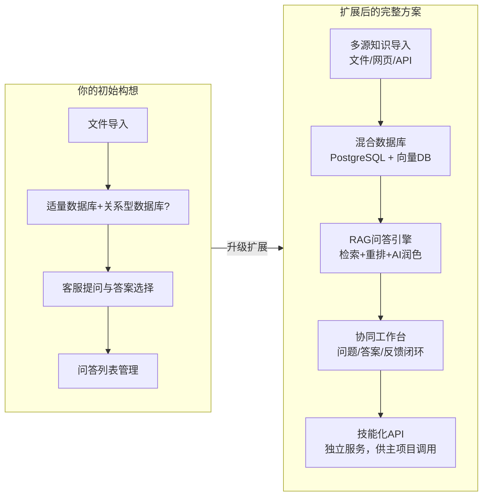
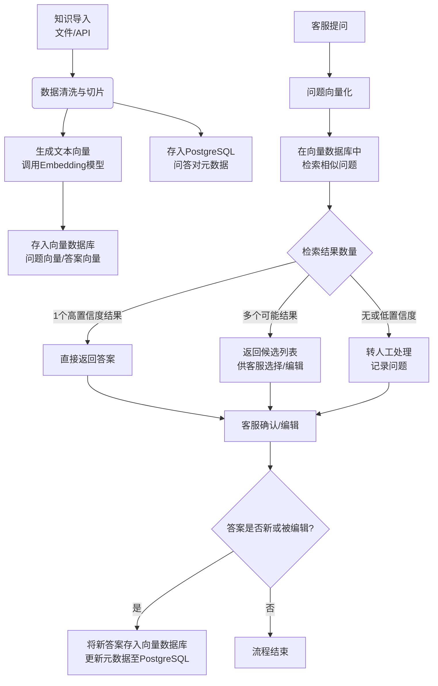
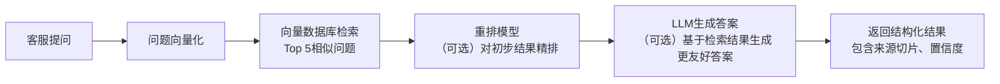
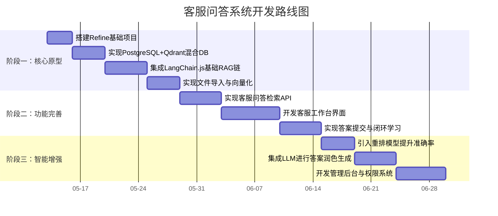

好的，让我们来一场深入的头脑风暴，围绕你的客服问答系统构建一个完整、可扩展的方案。

## 🧠 核心结论与系统全景

基于你的需求，最合理的架构是：**一个基于Node.js的全栈项目，采用“关系型数据库+向量数据库”的混合存储，并引入RAG（检索增强生成）技术栈**。项目应包含一个独立的、可被调用的“问答技能”核心服务，而非将整个项目作为脚本。

以下是你构想的系统与我的扩展方案的全景对比：



接下来，我们将逐一拆解你提出的问题，并构建这个系统的详细方案。

## 1. 数据库选型与业务分配：混合架构是关键

你的直觉非常准确：**单一数据库无法同时满足结构化数据管理和语义相似度搜索的需求**。

### 1.1 推荐的混合数据库架构

| 数据库类型 | 推荐选择 | 核心职责 | 存储内容示例 |
| :--- | :--- | :--- | :--- |
| **关系型数据库** | PostgreSQL | 处理结构化数据、事务、复杂查询 | 用户信息、角色权限、问答对元数据（ID、分类、创建者、状态）、操作日志 |
| **向量数据库** | Qdrant / Milvus / Weaviate | 处理语义相似度搜索 | 问答对的文本嵌入向量（问题向量、答案向量） |

**为什么是PostgreSQL？**
它功能强大，支持JSON字段（可存储问答对中的额外元数据），且与Node.js生态（如Prisma, TypeORM）结合良好。更重要的是，**它是管理问答对“生命周期”（创建、审核、发布、关闭）的最佳选择**。

**为什么需要向量数据库？**
因为客服问同一个问题的方式千变万化。用户可能问“怎么退货？”、“商品不满意如何退款？”、“退换货流程是什么？”。向量数据库通过比较语义，能将这些不同表述匹配到同一个标准答案【turn0search1】。这是传统关键词搜索无法做到的。

### 1.2 数据流与业务分配



**业务分配原则**：
*   **PostgreSQL是“主”**：所有问答对的“身份证”（ID）和“状态”（是否启用、关闭原因）都由它管理。任何对问答对的增删改查，都必须先在PostgreSQL中完成，再同步至向量数据库。
*   **向量数据库是“辅”**：它只负责根据语义进行“检索”和“匹配”。它的数据是PostgreSQL的派生数据，用于提升查询性能和智能性。

> 💡 **小贴士**：你可以从一个轻量级的向量数据库（如Qdrant）开始，它与Node.js集成简单，且对开发友好。后期如果数据量巨大，再迁移至Milvus等分布式方案。

## 2. 项目结构与技能化：如何不把整个项目当脚本？

这是架构设计的核心。你的担忧完全正确——将一个包含用户管理、权限、知识库维护的完整后台作为“技能”是不合理的。

### 2.1 推荐的分层架构

```
客服问答系统（全栈项目）
├── packages/
│   ├── core/                  # 核心领域逻辑（可被独立调用）
│   │   ├── qna-skill/         # 🎯 问答技能核心（Node.js包）
│   │   │   ├── src/
│   │   │   │   ├── services/  # 问答检索、答案管理服务
│   │   │   │   ├── models/    # 数据模型定义
│   │   │   │   └── index.ts   # 对外暴露的API（函数）
│   │   │   └── package.json
│   │   └── ...                # 其他核心业务包
│   ├── server/                # 后端API服务（主项目）
│   │   ├── src/
│   │   │   ├── modules/       # 用户、权限、知识库管理等模块
│   │   │   ├── api/           # REST/GraphQL接口，调用core中的skill
│   │   │   └── ...
│   │   └── ...
│   └── web/                   # 前端界面
├── package.json               # Monorepo管理（如使用pnpm workspace）
```

**关键点**：
1.  **`qna-skill` 是一个独立的npm包**：它封装了问答检索、答案提交、知识同步的所有逻辑。它只依赖于数据库连接和向量检索库，**不依赖任何Web框架（如Express）**。
2.  **主项目（`server`）是技能的“宿主”和“管理后台”**：它提供HTTP API，接收客服的请求，然后调用`qna-skill`包中的函数完成具体工作。同时，它也提供管理界面，用于维护用户、角色和知识库。
3.  **技能如何与项目交互**：交互通过**函数调用**完成。主项目的API路由调用技能包的函数，技能包返回结果（如检索到的答案列表），主项目再将其格式化后返回给前端。

### 2.2 技能化API设计示例

在 `qna-skill` 包中，你可能会暴露如下核心API：

```javascript
// packages/core/qna-skill/src/index.ts
export class QnASkill {
  constructor(private db: Database, private vectorDb: VectorDatabase) {}

  /**
   * 检索问题
   * @param question 客服输入的问题
   * @param topK 返回最相似的前K个结果
   * @returns 候选答案列表
   */
  async searchQuestion(question: string, topK: number = 3): Promise<SearchResult[]> {
    // 1. 将问题向量化
    // 2. 在向量数据库中检索相似问题
    // 3. 从PostgreSQL中获取完整问答对信息
    // 4. 返回排序后的结果
  }

  /**
   * 提交或更新答案
   * @param answerData 答案数据（可能来自客服编辑或AI生成）
   * @returns 更新后的问答对ID
   */
  async submitAnswer(answerData: AnswerSubmitDTO): Promise<string> {
    // 1. 将新答案存入PostgreSQL，获取ID
    // 2. 将答案文本向量化，存入向量数据库
    // 3. 如果是更新，可能需要失效旧的向量
    // 4. 返回ID
  }
}
```

主项目的API则非常轻量：

```javascript
// packages/server/src/api/qna.ts
import { QnASkill } from '@your-org/core/qna-skill';

const skill = new QnASkill(db, vectorDb);

router.post('/qna/search', async (req, res) => {
  const results = await skill.searchQuestion(req.body.question);
  res.json(results);
});

router.post('/qna/submit', async (req, res) => {
  const id = await skill.submitAnswer(req.body);
  res.json({ id });
});
```

这样，技能逻辑高度内聚，主项目只负责权限校验、请求转发和结果渲染。

## 3. 开发基础与开源项目推荐：站在巨人肩膀上

你提到找开源脚手架，这是明智之举。但客服问答系统有特殊性，我建议分两步走：

### 3.1 第一步：选择全栈开源项目作为脚手架

你需要一个包含用户、权限、后台管理的基础项目。**推荐以下两个**：

| 项目 | 技术栈 | 特点 | 适用性 |
| :--- | :--- | :--- | :--- |
| **[Refine](https://github.com/refinedev/refine)** | React, Node.js (Express), TypeScript | 基于React的管理面板框架，提供CRUD、鉴权等开箱即用功能 | **强烈推荐**。它专注于后台，不绑定特定UI库，你可以轻松集成问答管理界面。 |
| **[Next-Auth](https://github.com/nextauthjs/next-auth) + [Prisma](https://github.com/prisma/prisma) 示例项目** | Next.js, Prisma, NextAuth | 提供完整的认证流程和数据库ORM | 适合希望前后端一体，使用Next.js全栈开发的情况。 |

**选择Refine的理由**：它是一个“无头”框架，意味着它只提供逻辑和数据流，你可以自由选择UI组件库（如Ant Design, Material UI），这非常适合构建定制化的客服工作台。

### 3.2 第二步：集成或借鉴RAG开源项目

真正的问答智能来自RAG（检索增强生成）技术栈。与其从零开发，不如集成或借鉴成熟的开源项目。

| 项目 | 核心功能 | 与你的系统关系 |
| :--- | :--- | :--- |
| **[LangChain.js](https://github.com/langchain-ai/langchainjs)** | LLM应用开发框架，提供文档加载、切分、向量存储、检索链 | **核心依赖**。你的`qna-skill`可以基于LangChain.js构建，它已经实现了与多种向量数据库和LLM的集成。 |
| **[Anything LLM](https://github.com/Mintplex-Labs/anything-llm)** | 全功能RAG应用，支持多种文档、向量数据库和LLM | **功能参考**。它可以作为一个独立的智能体运行，你可以将其核心的RAG逻辑提取出来，集成到你的`qna-skill`中。 |
| **[Quivr](https://github.com/QuivrHQ/quivr)** | 另一个流行的RAG系统，侧重于文件管理和多模态 | **架构参考**。它的文件处理、向量化存储和检索流程设计很值得借鉴。 |

> 💡 **最佳实践**：**不要直接使用Anything LLM或Quivr作为你的主系统**，因为它们是独立的、面向终端用户的应用。你的系统需要深度定制（如与客服工作流集成、权限管理）。**应该使用LangChain.js作为“引擎”，在它的基础上构建你的业务逻辑**。

## 4. 核心功能实现方案：超越你的初步设想

### 4.1 知识导入与处理

你提到支持txt、md、word、excel，这很好，但可以更强大。

<details>
<summary>📖 文件处理与向量化流程详解</summary>

1.  **文件解析**：使用 `mammoth` (Word), `xlsx` (Excel), `markdown-it` (MD) 等库解析文件内容。
2.  **智能切片**：不要把整个文件作为一个文档。LangChain.js提供了 `RecursiveCharacterTextSplitter` 等工具，可以根据段落、句子智能切分文本，每个切片成为一个独立的“知识块”。
3.  **元数据附加**：每个切片都应携带来源文件名、章节标题等元数据，存入PostgreSQL，便于后续溯源和管理。
4.  **向量化与存储**：调用OpenAI, 百度文心等Embedding模型，将每个切片转化为向量，存入向量数据库。同时，在PostgreSQL中创建记录，关联文件ID和切片ID。

</details>

### 4.2 问答检索与AI增强

这是系统的灵魂。我建议的检索流程如下：



**关键增强点**：
*   **重排（Reranking）**：初次检索可能基于向量相似度，但语义不完全匹配。可以使用 `cross-encoder` 模型对Top K结果进行二次精排，提升准确性。
*   **AI润色与生成**：对于检索到的答案，可以调用LLM进行“润色”，使其更口语化、更符合客服语气。甚至可以让LLM基于多个相关切片，**生成一个综合性的答案**，而不仅仅是返回原文。

### 4.3 闭环学习机制

你提到“客服选择或重新编辑答案，然后继续存储”，这非常重要，这是系统自我进化的关键。

1.  **反馈收集**：客服对答案的“选择”、“编辑”、“标记无用”都是宝贵反馈。
2.  **数据回流**：这些反馈需要被记录下来（存入PostgreSQL），并定期用于：
    *   **微调检索模型**：如果某个问题经常被误匹配，可以调整其向量或增加训练样本。
    *   **优化知识库**：如果某个答案被频繁编辑，可能意味着原始文档需要更新。
    *   **AI训练**：积累的高质量问答对，可以用于微调一个专属于你公司的客服LLM。

## 5. 开发路径与行动建议

基于以上分析，我为你规划一个分阶段的开发路径：



**立即行动清单**：
1.  **初始化项目**：使用 `pnpm init` 创建Monorepo，并安装Refine。
2.  **搭建数据库**：本地安装PostgreSQL和Qdrant，使用Prisma定义数据模型。
3.  **构建最小技能**：在 `core/qna-skill` 中，使用LangChain.js实现一个简单的 `searchQuestion` 方法，能对单个问题进行检索。
4.  **验证概念**：写一个脚本，导入几个FAQ文件，然后通过技能API提问，验证检索效果。

## 总结与最终建议

你的想法非常有价值，核心方向完全正确。我的建议可以概括为：

1.  **架构**：采用 **“主项目+技能包”** 的分层架构，技能包通过函数API被主项目调用。
2.  **数据库**：坚定使用 **“PostgreSQL + 向量数据库”** 的混合方案，各司其职。
3.  **开发**：**基于Refine搭建后台，基于LangChain.js构建问答技能**，这是最高效的路径。
   4.  **目标**：不要只做一个“文档检索器”，要构建一个**具备闭环学习能力的智能客服工作台**，让每一次客服交互都让系统变得更聪明。

这个系统一旦建成，将远超一个简单的FAQ查询工具，它将成为客服部门的核心知识引擎和效率倍增器。祝你开发顺利！